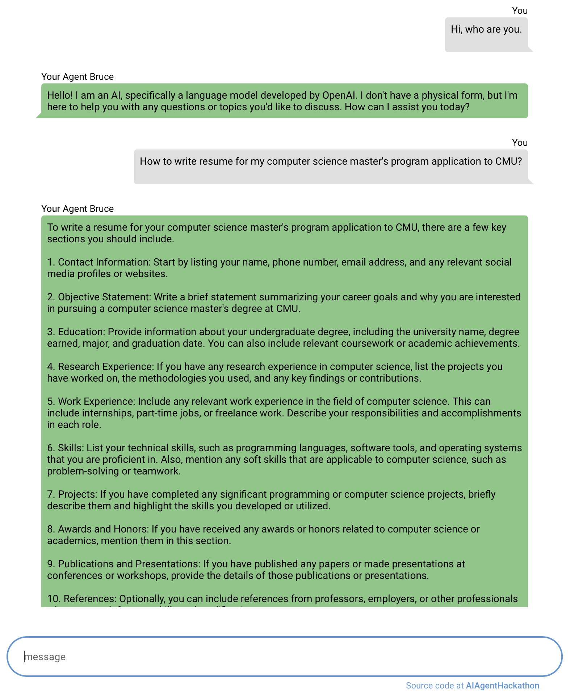
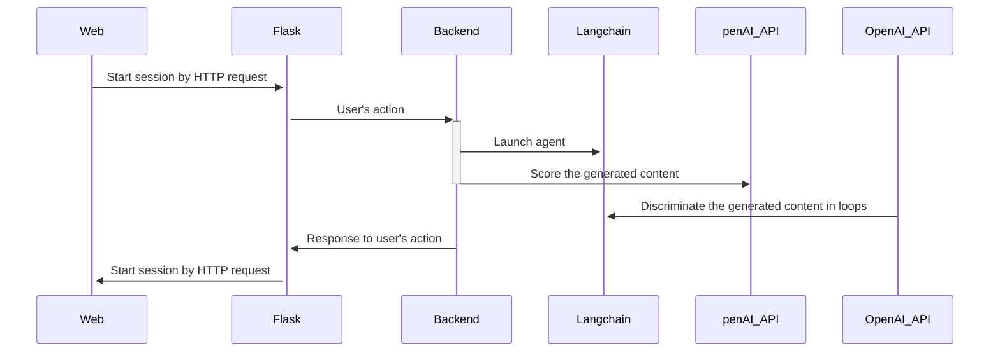

# Proposal for Architecture
A proposal to the architecture for academic application agent. In this proposal, langchain is selected as an autonomous agent.
Author: Bruce

## Graph

The graph indicates a workflow from a user entering the webpage of our product to the backend, GPT API callings, and finally displaying the generated content to the user.

 - `Web/NiceGUI` either HTML-and-JS-based web or NiceGUI(python front end library) is used for interface.
 - `FLask` provides API of our backend which is callable from frontend. Hopefully, an independent thread holds the Flask server.
 - `Backend` Threads are created for multitasks. The backend handles the communications to OpenAI API and Langchain tasks.
 - `Langchain` Autonomous agent for language processing.
 - `OpenAI API` GPT4 and GPT3.5-turbo-16k are suggested for the larger maximum number of tokens per request. 
	- Use the [Tokenizer](https://platform.openai.com/tokenizer) to estimate the number of tokens for some specific sentences.
	- Use Function Calling of GPT API to cut the redundancy of generated content with a JSON formatter. See the [tutorial](https://www.mlq.ai/gpt-function-calling-getting-started/).

> Web+Flask can be replaced by NiceGUI with the sacrifice of scalability. For easier demonstration, the instance uses NiceGUI.

# Code Example
`chat_bot.py` is a quick example of using NiceGUI, Langchain, and OpenAI for chatbots.
## Prerequisite

 1. install library
	```
	pip install -r requirements.txt

	```
2. set the OpenAI API key as your environment variable. In terminal:
	```
	export OPENAI_API_KEY=[YOUR_KEY_HERE]
	```
4. run the script
	```
	python chatbot.py
	```
5. open a web browser, navigate to IP: http://localhost:8080